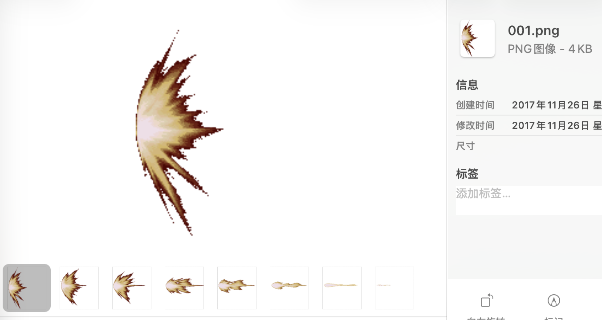
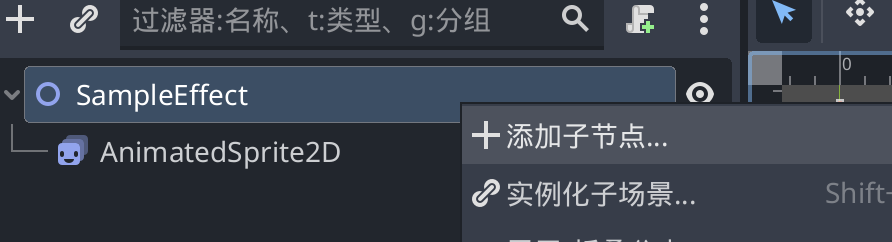
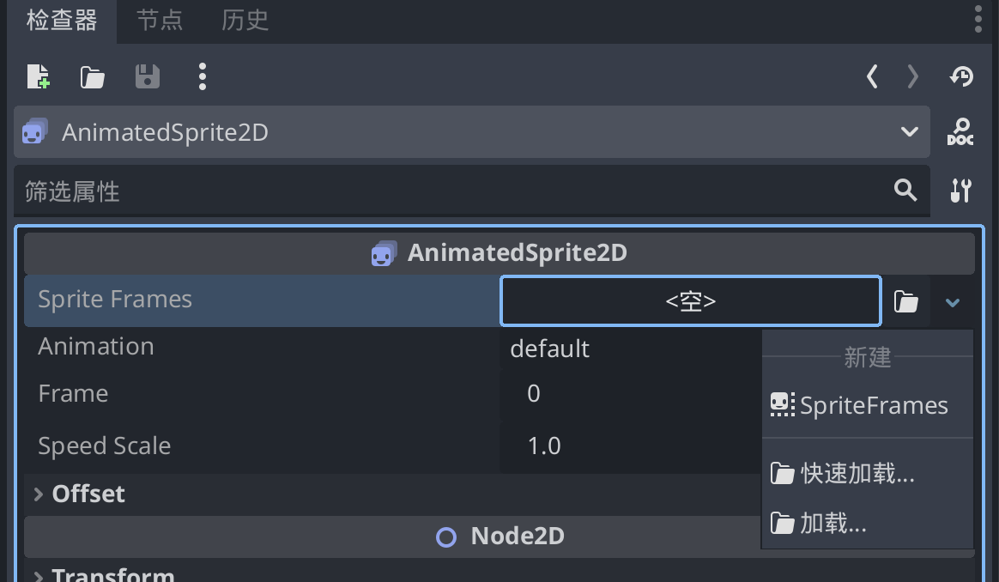
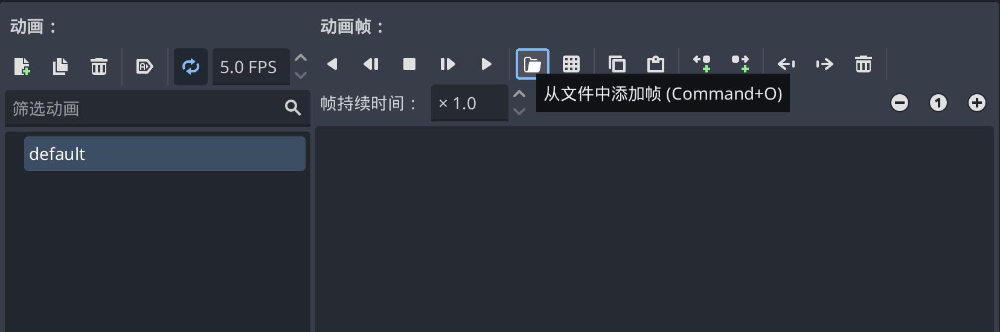
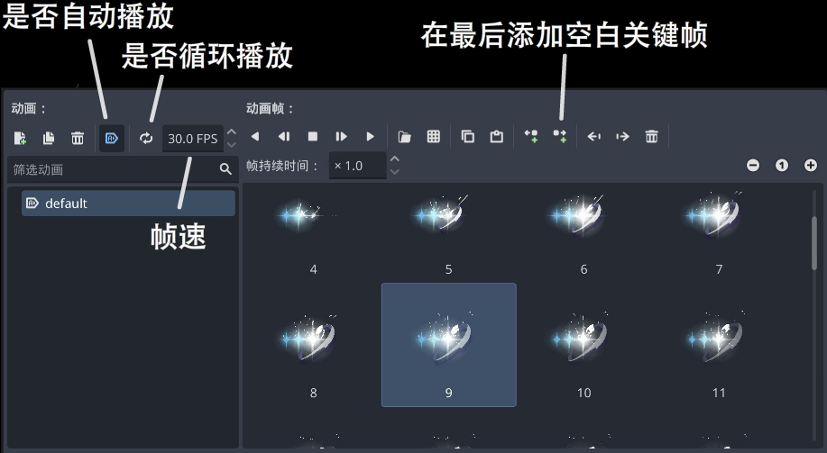
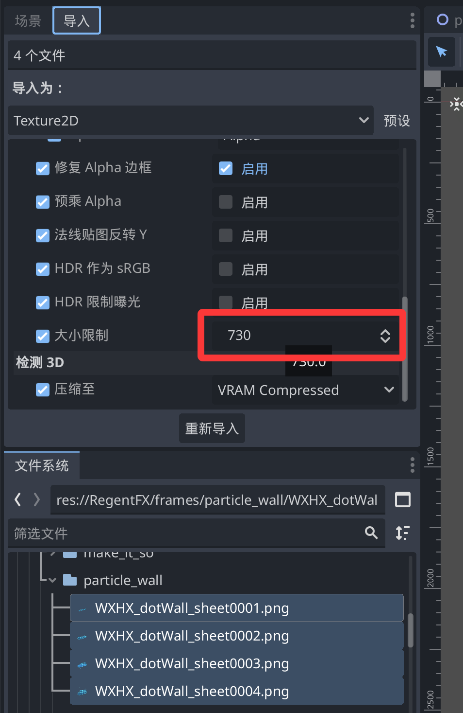

## 帧动画序列特效

帧动画是最基础的 VFX 形式：将多张 **带透明通道的** PNG 序列图导入 Godot，组成 `AnimatedSprite2D` 动画，在游戏中实例化播放。



帧动画的优点是常见，简单，很多网络下载的特效和导出的特效都是序列帧格式
缺点是性能差，需要缩图和优化。具体详见优化章节。
### 1.导入序列图

将 PNG 序列图放入 Mod 资源目录，例如：

```
YourMod/images/effect_1/fn0001.png
YourMod/images/effect_1/fn0002.png
...
```

### 2.创建场景文件 (.tscn)

在 Godot 编辑器中新建场景，根节点为 `Node2D`，并添加 `AnimatedSprite2D` 子节点。

我们尽量通过Godot(Megadot)编辑器手动创建，用ai生成可能会有各种引用错误。



随后我们点击AnimatedSprite2D节点，在右侧检查器新建一个SpriteFrames，


再点击这个SpriteFrames，会出现动画序列帧的编辑界面，我们点击从文件中添加帧，将刚才的序列帧按顺序导入进去。


导入成功后，可以在下面看到序列帧图表。这里列出了一些常用按钮，可以按需调整你的特效。


示例场景脚本参考(AI参考)：

```tscn
[gd_scene load_steps=5 format=3 uid="uid://5p6c4m60db7a"]

[ext_resource type="Texture2D" path="res://RegentFX/frames/guiding_star/fn0001.png" id="1_t3dcf"]
[ext_resource type="Texture2D" path="res://RegentFX/frames/guiding_star/fn0002.png" id="2_fuxtp"]

[sub_resource type="SpriteFrames" id="SpriteFrames_pwecx"]
animations = [{
"frames": [{
"duration": 1.0,
"texture": ExtResource("1_t3dcf")
}, {
"duration": 1.0,
"texture": ExtResource("2_fuxtp")
}],
"loop": true,
"name": &"default",
"speed": 5.0
}]

[node name="SampleEffect" type="Node2D"]

[node name="AnimatedSprite2D" type="AnimatedSprite2D" parent="."]
sprite_frames = SubResource("SpriteFrames_pwecx")

```

### 3：附加 C# 脚本控制动画

在游戏本体中，往往是通过脚本来播放和销毁粒子动画，但是我们的AnimatedSprite2D拥有自动播放功能，因此如果你没有比如延时播放等需求，无需设置播放相关的脚本

但是销毁脚本需要准备，如果你的特效是一次性特效（比如击打特效），而非循环常驻的特效，需要让其播放完后自动销毁。

我们给AnimatedSprite2D绑上一个自定义脚本即可。如果你不想每个场景加一个脚本，也可以通过3-3章中VFXUtil的自定义方法销毁特效。

```csharp
using Godot;

public partial class Effect : AnimatedSprite2D {
    public override void _Ready() {
    // 动画播放完毕后自动删除自己
        AnimationFinished += QueueFree;
    }
}
```


### 4.其他技巧

- 有的时候，你导入的帧图片的分辨率过大，在游戏中有明显的卡顿，我们可以通过修改导入设置来缩图。
  
批量勾选你的图片，在左上角导入设置这里，选择最小分辨率像素，比如原来的图是1080p，可以修改成720/540来缩图。