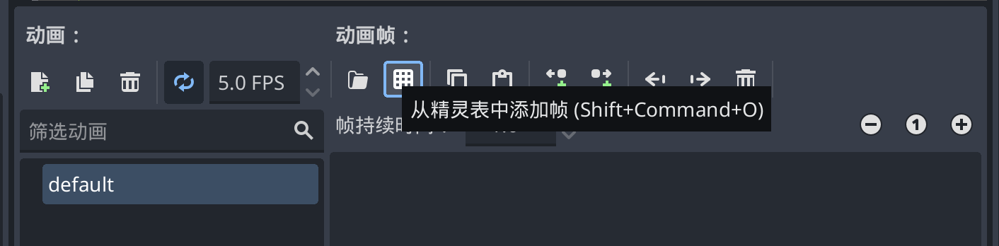
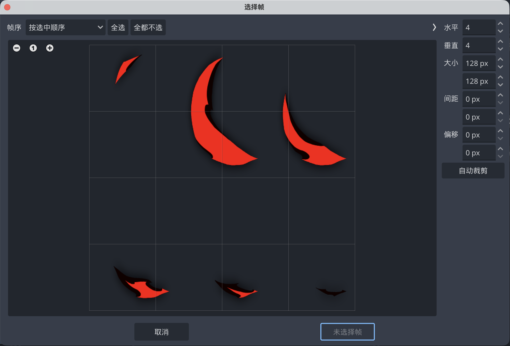
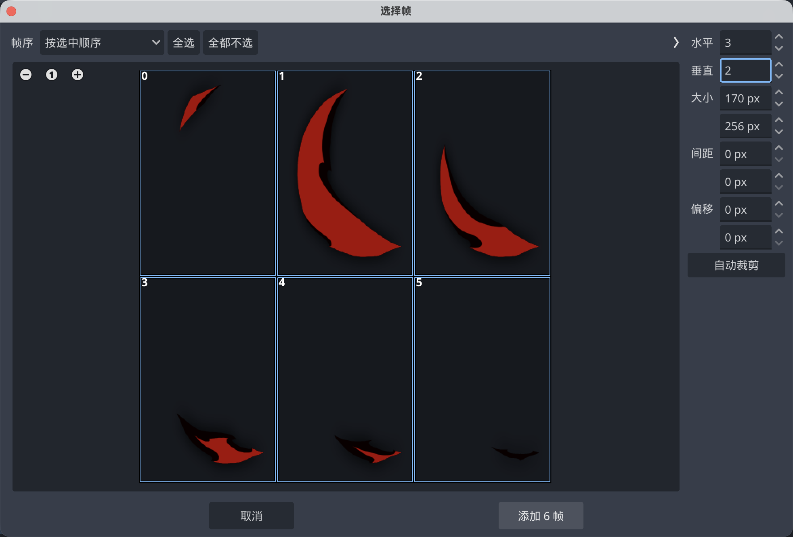

## 材质图集(Texture Atlas)

材质图集，又称素材表，精灵(Sprite)表等。 有时候你拥有的素材不是多个图片，而是一张图片上包含了所有的部分，按矩形表格状分布。

比如游戏内自带的斩击特效(vfx_slash)

材质图集(纹理图集)的优点是性能相对较优，空间占用小，但是不适合大范围的特效

### 1.导入精灵图表
和帧动画的处理完全相同，只不过在导入这一步有区别，点击从精灵表中添加帧，导入刚才我们准备的图

### 2.加载图集并自动切割

现在图集显示在预览区。但我们要把它变成一帧一帧的动画。

水平数量：图集中一行有几帧

垂直数量：图集中一共有几行

勾选 “裁切” 可自动去除空白边缘。

比如这个图我们需要选择水平3，垂直2，并且依次点击6次，然后添加即可。

