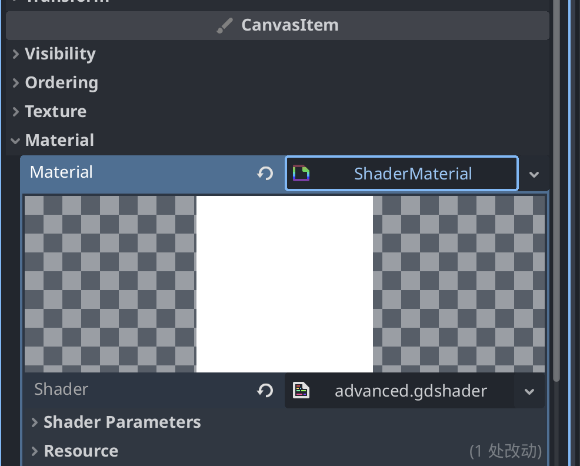
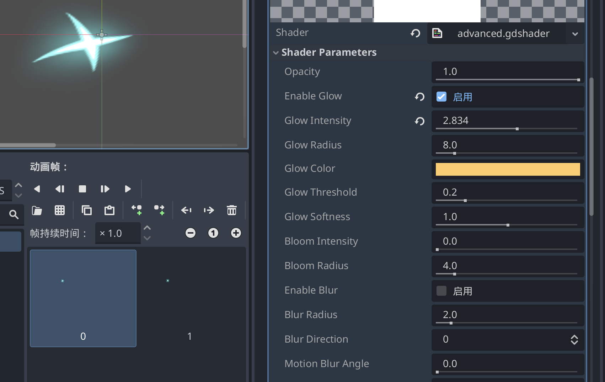
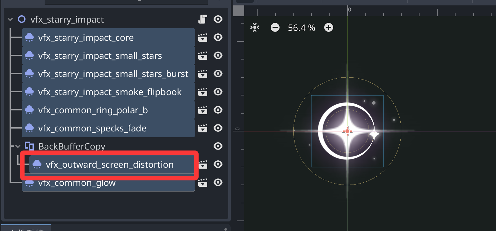
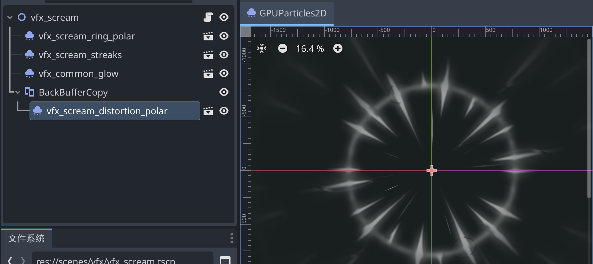

## Shader

Shader是高级特效的一部分，我们会在很多地方用到它。

- 动态调色与风格化：不修改原图，就能实现角色受伤闪红、冻结变蓝、中毒变绿等效果。
- 纹理混合与程序化细节：将多张贴图按遮罩混合，或通过噪声算法生成动态纹理（如火焰、水流、云）。
- 描边、发光与轮廓：基于法线或深度信息，为素材添加外发光、边缘光或漫画风描边。
- UV 动画与变形：偏移纹理坐标做出流水、滚动背景，或扭曲顶点实现飘动、呼吸效果。

以下举几个具体的例子

### 1.使用Shader丰富现有的特效/动画
有的时候，你已经使用帧动画/粒子实现了一个特效，但你感觉他不够亮，颜色不对，打击感/运动感不足等。

或者说你想办法弄一个史莱姆素材，这时候你想为这个史莱姆动画做一些不同颜色的，发光的，扭曲的变体。

这时候就可以给特效本体的材质加上一个shader，并且为其修改相关参数。

这里提供一个万能的shader，存下来保存为advanced.gdshader。

```shaderlab
shader_type canvas_item;

// =============================================
// 高级图像滤镜 - Photoshop / Animate / CSS3 Filter 合集
// =============================================

// === 基础 ===
// 整体透明度
uniform float opacity : hint_range(0.0, 1.0) = 1.0;

// === 发光 / 晕染 (Glow & Bloom) ===
// 启用发光
uniform bool enable_glow = false;
// 发光强度
uniform float glow_intensity : hint_range(0.0, 5.0) = 1.0;
// 发光半径（像素）
uniform float glow_radius : hint_range(0.0, 64.0) = 8.0;
// 发光颜色
uniform vec4 glow_color : source_color = vec4(1.0, 0.8, 0.4, 1.0);
// 发光阈值（低于此亮度不发光）
uniform float glow_threshold : hint_range(0.0, 1.0) = 0.2;
// 发光柔和度
uniform float glow_softness : hint_range(0.0, 2.0) = 1.0;
// 晕染(Bloom) - 让亮部向周围扩散
uniform float bloom_intensity : hint_range(0.0, 3.0) = 0.0;
uniform float bloom_radius : hint_range(0.0, 32.0) = 4.0;

// === 模糊 (Blur) ===
// 启用模糊
uniform bool enable_blur = false;
// 模糊半径
uniform float blur_radius : hint_range(0.0, 20.0) = 2.0;
// 高斯模糊方向 (0=双向, 1=水平, 2=垂直)
uniform int blur_direction : hint_range(0, 2) = 0;
// 运动模糊角度
uniform float motion_blur_angle : hint_range(0.0, 360.0) = 0.0;
// 运动模糊距离
uniform float motion_blur_distance : hint_range(0.0, 20.0) = 0.0;

// === 锐化 (Sharpen) ===
uniform bool enable_sharpen = false;
uniform float sharpen_amount : hint_range(0.0, 3.0) = 1.0;
uniform float sharpen_radius : hint_range(0.5, 3.0) = 1.0;

// === 扭曲 (Distortion) ===
// 启用扭曲
uniform bool enable_distortion = false;
// 波纹扭曲强度
uniform float ripple_intensity : hint_range(0.0, 0.1) = 0.0;
// 波纹频率
uniform float ripple_frequency : hint_range(0.0, 50.0) = 10.0;
// 波纹速度
uniform float ripple_speed : hint_range(-10.0, 10.0) = 1.0;
// 漩涡扭曲强度
uniform float swirl_intensity : hint_range(0.0, 2.0) = 0.0;
// 漩涡中心偏移
uniform vec2 swirl_center = vec2(0.5, 0.5);
// 镜头畸变（鱼眼/桶形）
uniform float lens_distort : hint_range(-1.0, 1.0) = 0.0;
// 色差偏移（RGB分离）
uniform float chromatic_aberration : hint_range(0.0, 0.05) = 0.0;

// === 色调 / 颜色调整 (Color Adjustment) ===
// 色相旋转（度）
uniform float hue_shift : hint_range(-180.0, 180.0) = 0.0;
// 饱和度
uniform float saturation : hint_range(0.0, 2.0) = 1.0;
// 亮度
uniform float brightness : hint_range(-1.0, 1.0) = 0.0;
// 对比度
uniform float contrast : hint_range(0.0, 2.0) = 1.0;
// 颜色叠加 (Color Overlay)
uniform bool enable_color_overlay = false;
uniform vec4 overlay_color : source_color = vec4(1.0, 0.0, 0.0, 0.5);
uniform int overlay_blend_mode : hint_range(0, 5) = 0; // 0=正常,1=正片叠底,2=滤色,3=叠加,4=柔光,5=颜色加深
// 渐变映射
uniform bool enable_gradient_map = false;
uniform vec4 gradient_color1 : source_color = vec4(0.0, 0.0, 0.0, 1.0);
uniform vec4 gradient_color2 : source_color = vec4(1.0, 1.0, 1.0, 1.0);

// === 特殊效果 ===
// 描边/边缘检测
uniform bool enable_outline = false;
uniform float outline_width : hint_range(0.0, 8.0) = 2.0;
uniform vec4 outline_color : source_color = vec4(0.0, 0.0, 0.0, 1.0);
// 像素化
uniform float pixelate_size : hint_range(0.0, 64.0) = 0.0;
// 反相
uniform bool invert_colors = false;
// 灰度
uniform bool grayscale = false;
// _sepia 复古
uniform bool sepia = false;
// 阈值/二值化
uniform float threshold_level : hint_range(0.0, 1.0) = 0.0;

// =============================================
// 工具函数
// =============================================

// RGB -> HSV
vec3 rgb2hsv(vec3 c) {
    vec4 K = vec4(0.0, -1.0 / 3.0, 2.0 / 3.0, -1.0);
    vec4 p = mix(vec4(c.bg, K.wz), vec4(c.gb, K.xy), step(c.b, c.g));
    vec4 q = mix(vec4(p.xyw, c.r), vec4(c.r, p.yzx), step(p.x, c.r));
    float d = q.x - min(q.w, q.y);
    float e = 1.0e-10;
    return vec3(abs(q.z + (q.w - q.y) / (6.0 * d + e)), d / (q.x + e), q.x);
}

// HSV -> RGB
vec3 hsv2rgb(vec3 c) {
    vec4 K = vec4(1.0, 2.0 / 3.0, 1.0 / 3.0, 3.0);
    vec3 p = abs(fract(c.xxx + K.xyz) * 6.0 - K.www);
    return c.z * mix(K.xxx, clamp(p - K.xxx, 0.0, 1.0), c.y);
}

// 混合模式
vec3 blend(vec3 base, vec3 blend, int mode) {
    if (mode == 1) return base * blend; // Multiply
    if (mode == 2) return 1.0 - (1.0 - base) * (1.0 - blend); // Screen
    if (mode == 3) {
        // Overlay
        return mix(2.0 * base * blend, 1.0 - 2.0 * (1.0 - base) * (1.0 - blend), step(0.5, base));
    }
    if (mode == 4) {
        // Soft Light
        return mix(2.0 * base * blend + base * base * (1.0 - 2.0 * blend), 
                   sqrt(base) * (2.0 * blend - 1.0) + 2.0 * base * (1.0 - blend), 
                   step(0.5, blend));
    }
    if (mode == 5) return 1.0 - (1.0 - blend) / (base + 0.001); // Color Burn
    return blend; // Normal
}

// 高质量高斯模糊
vec4 gaussian_blur(sampler2D tex, vec2 uv, vec2 pixel_size, float radius, int direction) {
    if (radius <= 0.0) return texture(tex, uv);
    
    vec4 color = vec4(0.0);
    float total_weight = 0.0;
    
    int samples = int(min(radius * 2.0 + 1.0, 32.0));
    
    for (int i = -samples; i <= samples; i++) {
        float fi = float(i);
        float weight = exp(-(fi * fi) / (2.0 * radius * radius + 0.001));
        
        vec2 offset = vec2(0.0);
        if (direction == 0 || direction == 1) offset.x = fi * pixel_size.x;
        if (direction == 0 || direction == 2) offset.y = fi * pixel_size.y;
        
        color += texture(tex, uv + offset) * weight;
        total_weight += weight;
    }
    
    return color / total_weight;
}

// 双向高斯模糊
vec4 gaussian_blur_2d(sampler2D tex, vec2 uv, vec2 pixel_size, float radius) {
    if (radius <= 0.0) return texture(tex, uv);
    
    // 分两步模拟：先水平后垂直
    vec4 horizontal = vec4(0.0);
    float total_weight = 0.0;
    int samples = int(min(radius * 2.0 + 1.0, 32.0));
    
    for (int i = -samples; i <= samples; i++) {
        float fi = float(i);
        float weight = exp(-(fi * fi) / (2.0 * radius * radius + 0.001));
        horizontal += texture(tex, uv + vec2(fi * pixel_size.x, 0.0)) * weight;
        total_weight += weight;
    }
    horizontal /= total_weight;
    
    vec4 vertical = vec4(0.0);
    total_weight = 0.0;
    for (int i = -samples; i <= samples; i++) {
        float fi = float(i);
        float weight = exp(-(fi * fi) / (2.0 * radius * radius + 0.001));
        vertical += texture(tex, uv + vec2(0.0, fi * pixel_size.y)) * weight;
        total_weight += weight;
    }
    vertical /= total_weight;
    
    return (horizontal + vertical) * 0.5;
}

// 运动模糊
vec4 motion_blur(sampler2D tex, vec2 uv, vec2 pixel_size, float distance, float angle_deg) {
    if (distance <= 0.0) return texture(tex, uv);
    
    float angle = radians(angle_deg);
    vec2 dir = vec2(cos(angle), sin(angle)) * pixel_size * distance;
    
    vec4 color = vec4(0.0);
    int samples = 16;
    for (int i = 0; i < samples; i++) {
        float t = float(i) / float(samples - 1);
        color += texture(tex, uv + dir * (t - 0.5));
    }
    return color / float(samples);
}

// 多采样发光
vec4 get_glow(sampler2D tex, vec2 uv, vec2 pixel_size, float radius, float threshold, float intensity, vec4 glow_col, float softness) {
    if (radius <= 0.0 || intensity <= 0.0) return vec4(0.0);
    
    vec4 glow = vec4(0.0);
    float total_weight = 0.0;
    int samples = int(min(radius * 1.5 + 4.0, 24.0));
    
    for (int x = -samples; x <= samples; x++) {
        for (int y = -samples; y <= samples; y++) {
            if (x == 0 && y == 0) continue;
            vec2 offset = vec2(float(x), float(y)) * pixel_size * radius;
            vec4 sample_col = texture(tex, uv + offset);
            
            float lum = dot(sample_col.rgb, vec3(0.299, 0.587, 0.114));
            float mask = smoothstep(threshold, threshold + 0.1 + softness * 0.2, lum);
            
            float dist = length(vec2(float(x), float(y)));
            float weight = exp(-dist / (radius * 0.5 + 0.1));
            
            glow += sample_col * mask * weight;
            total_weight += weight;
        }
    }
    
    glow = glow / total_weight * intensity;
    return glow * glow_col;
}

// 锐化
vec4 sharpen(sampler2D tex, vec2 uv, vec2 pixel_size, float amount, float radius) {
    vec4 center = texture(tex, uv);
    vec4 blurred = gaussian_blur_2d(tex, uv, pixel_size, radius);
    return center + (center - blurred) * amount;
}

// 边缘检测/描边
vec4 outline(sampler2D tex, vec2 uv, vec2 pixel_size, float width, vec4 line_color) {
    float alpha = 0.0;
    int steps = 8;
    for (int i = 0; i < steps; i++) {
        float angle = float(i) / float(steps) * 6.28318;
        vec2 offset = vec2(cos(angle), sin(angle)) * pixel_size * width;
        alpha = max(alpha, texture(tex, uv + offset).a);
    }
    
    float center_alpha = texture(tex, uv).a;
    alpha = alpha * (1.0 - center_alpha);
    
    return vec4(line_color.rgb, alpha * line_color.a);
}

// 扭曲UV
vec2 distort_uv(vec2 uv) {
    vec2 distorted = uv;
    
    // 像素化
    if (pixelate_size > 0.0) {
        distorted = floor(distorted * pixelate_size) / pixelate_size;
    }
    
    // 漩涡
    if (swirl_intensity > 0.0) {
        vec2 center = swirl_center;
        vec2 delta = distorted - center;
        float dist = length(delta);
        float angle = atan(delta.y, delta.x);
        float swirl = swirl_intensity * (1.0 - dist) * 3.14159;
        angle += swirl * smoothstep(1.0, 0.0, dist * 2.0);
        distorted = center + vec2(cos(angle), sin(angle)) * dist;
    }
    
    // 波纹
    if (ripple_intensity > 0.0) {
        float ripple = sin(distorted.x * ripple_frequency + TIME * ripple_speed) 
                     * cos(distorted.y * ripple_frequency + TIME * ripple_speed);
        distorted += vec2(cos(ripple * 3.14159), sin(ripple * 3.14159)) * ripple_intensity;
    }
    
    // 镜头畸变
    if (lens_distort != 0.0) {
        vec2 center = vec2(0.5, 0.5);
        vec2 delta = distorted - center;
        float dist = length(delta);
        float factor = 1.0 + lens_distort * dist * dist;
        distorted = center + delta * factor;
    }
    
    return distorted;
}

// 颜色调整
vec3 adjust_color(vec3 color) {
    // HSV调整
    vec3 hsv = rgb2hsv(color);
    hsv.x += hue_shift / 360.0;
    hsv.x = fract(hsv.x);
    hsv.y *= saturation;
    hsv.z += brightness;
    color = hsv2rgb(hsv);
    
    // 对比度
    color = (color - 0.5) * contrast + 0.5;
    
    // 反相
    if (invert_colors) color = 1.0 - color;
    
    // 灰度
    if (grayscale) {
        float lum = dot(color, vec3(0.299, 0.587, 0.114));
        color = vec3(lum);
    }
    
    // 复古
    if (sepia) {
        color = vec3(
            dot(color, vec3(0.393, 0.769, 0.189)),
            dot(color, vec3(0.349, 0.686, 0.168)),
            dot(color, vec3(0.272, 0.534, 0.131))
        );
    }
    
    // 阈值
    if (threshold_level > 0.0) {
        float lum = dot(color, vec3(0.299, 0.587, 0.114));
        color = vec3(step(threshold_level, lum));
    }
    
    // 渐变映射
    if (enable_gradient_map) {
        float lum = dot(clamp(color, 0.0, 1.0), vec3(0.299, 0.587, 0.114));
        color = mix(gradient_color1.rgb, gradient_color2.rgb, lum);
    }
    
    return color;
}

// =============================================
// Main
// =============================================

void fragment() {
    vec2 pixel_size = TEXTURE_PIXEL_SIZE;
    vec2 uv = UV;
    
    // 1. 扭曲UV
    vec2 distorted_uv = distort_uv(uv);
    
    // 2. 色差分离采样
    vec4 tex_color;
    if (chromatic_aberration > 0.0 && enable_distortion) {
        float r = texture(TEXTURE, distorted_uv + vec2(chromatic_aberration, 0.0)).r;
        float g = texture(TEXTURE, distorted_uv).g;
        float b = texture(TEXTURE, distorted_uv - vec2(chromatic_aberration, 0.0)).b;
        float a = texture(TEXTURE, distorted_uv).a;
        tex_color = vec4(r, g, b, a);
    } else {
        tex_color = texture(TEXTURE, distorted_uv);
    }
    
    // 3. 发光
    vec4 glow = vec4(0.0);
    if (enable_glow) {
        glow = get_glow(TEXTURE, distorted_uv, pixel_size, glow_radius, glow_threshold, glow_intensity, glow_color, glow_softness);
    }
    
    // 4. Bloom
    vec4 bloom = vec4(0.0);
    if (bloom_intensity > 0.0) {
        bloom = get_glow(TEXTURE, distorted_uv, pixel_size, bloom_radius, 0.3, bloom_intensity, vec4(1.0), 0.5);
    }
    
    // 5. 模糊
    vec4 blur = vec4(0.0);
    if (enable_blur) {
        if (motion_blur_distance > 0.0) {
            blur = motion_blur(TEXTURE, distorted_uv, pixel_size, motion_blur_distance, motion_blur_angle);
        } else if (blur_direction == 0) {
            blur = gaussian_blur_2d(TEXTURE, distorted_uv, pixel_size, blur_radius);
        } else {
            blur = gaussian_blur(TEXTURE, distorted_uv, pixel_size, blur_radius, blur_direction);
        }
    }
    
    // 6. 锐化
    vec4 sharpened = vec4(0.0);
    if (enable_sharpen) {
        sharpened = sharpen(TEXTURE, distorted_uv, pixel_size, sharpen_amount, sharpen_radius);
    }
    
    // 合成基础颜色
    vec4 base_color = tex_color;
    if (enable_blur) base_color = mix(base_color, blur, 0.8);
    if (enable_sharpen) base_color = sharpened;
    
    // 7. 颜色调整
    base_color.rgb = adjust_color(base_color.rgb);
    
    // 8. 颜色叠加
    if (enable_color_overlay) {
        base_color.rgb = blend(base_color.rgb, overlay_color.rgb, overlay_blend_mode);
        base_color.a *= overlay_color.a;
    }
    
    // 9. 描边
    vec4 outline_col = vec4(0.0);
    if (enable_outline) {
        outline_col = outline(TEXTURE, distorted_uv, pixel_size, outline_width, outline_color);
    }
    
    // 最终合成
    vec3 final_rgb = base_color.rgb + glow.rgb + bloom.rgb;
    float final_alpha = max(base_color.a, outline_col.a);
    
    // 描边混合
    if (outline_col.a > 0.0) {
        final_rgb = mix(final_rgb, outline_col.rgb, outline_col.a);
    }
    
    // 应用透明度
    final_alpha *= opacity;
    
    COLOR = vec4(final_rgb, final_alpha);
}

```

我们为需要加上shader的节点(比如SpriteAnimation2D, Sprite2D等), 点击CanvasItem - Material 新建一个ShaderMaterial，然后快速加载刚才的Shader



随后点击shader，可以在下方调节各种参数。

包括了发光、曝光、模糊、动态模糊、锐化、扭曲、色相、描边、漩涡、波纹、色差偏移（RGB分离）等常见后处理效果。



### 2.区域效果

可以参考游戏中的储君攻击_受击特效starry_impact 和 尖叫 scream:


我们注意到这里的vfx_distortion相关 就是一个屏幕扭曲处理, 它表现为一块区域的扭曲。

shader是纯代码，AI友好的，这意味着我们需要仿照类似效果时，只需要把他的gdshader源码偷出来喂给AI，让AI实现你需要的效果即可。

